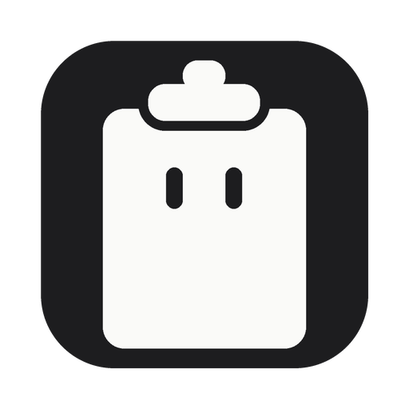
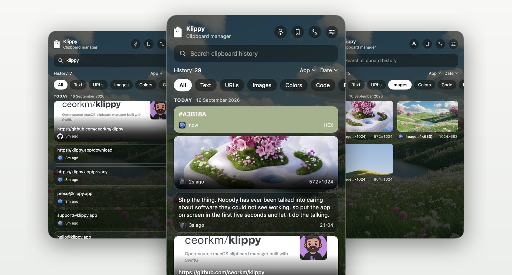

<div align="center">



# Klippy

**Everything you copy, kept and searchable, without ever leaving your Mac.**

<a href="https://apps.apple.com/us/app/clipboard-manager-klippy/id6812303323">
  
</a>

<br>


<br><br>



</div>

<br>

## See it work

https://github.com/ceorkm/klippy/raw/main/docs/demo.mp4

If your browser does not play that inline, [download the clip](docs/demo.mp4).

<br>

## What it does

|   | |
|:---:|:---|
|  | **Keeps your history.** Every copy lands in a searchable list, grouped by day. Text, images, files, colours. Click one to put it back on the clipboard. |
|  | **Sorts it for you.** Klippy reads what you copied and files it: links, images, files, colours, code, emails, API keys, card numbers, JSON, phone numbers, addresses. |
|  | **Finds anything.** Search months of history, or narrow by kind, by date, or by the app you copied from. |
|  | **Pin, save, merge.** Pin a clip to the top. Save one with a name. Select several and merge them into one clip, then open it later to get the pieces back. |
|  | **Stays out of the way.** `⌃⌘V` opens the panel. `⌃⌘1` to `⌃⌘0` recall a clip instantly. `⌃⌘↓` walks back through recent ones. Every shortcut is rebindable. |
|  | **Looks how you want.** Seven skins, two flat and five photographic, or drop in a picture of your own. Two widths, three text sizes. |

<br>

## Privacy

This is a clipboard manager, so it is worth being specific.

|   | |
|:---:|:---|
|  | Your history lives in `~/Library/Application Support/Klippy` and is never uploaded. No account, no server, no analytics. |
|  | Anything a password manager marks as concealed is skipped, not recorded. This follows the [nspasteboard.org](http://nspasteboard.org) convention and is on by default. Throwaway copies marked transient are always skipped too. |
|  | Mark any clip secret to hide it in the list, or tell Klippy never to record whole categories such as card numbers. |
|  | No Accessibility permission, no Screen Recording, no Full Disk Access. The global shortcuts use a system API that needs none of them. |

**The one network feature.** "Load link previews" asks a site you copied for its own preview image, the way a chat app shows a thumbnail. The request goes to that site and nowhere else. Links that carry a sign-in token or act the moment they open, such as a password reset, are never fetched. Turn the setting off and Klippy never touches the network at all.

Full details in [PRIVACY.md](PRIVACY.md).

<br>

## Install

**[Get it on the Mac App Store](https://apps.apple.com/us/app/clipboard-manager-klippy/id6812303323)**, free, sandboxed and updated automatically.

Or grab the [latest release](https://github.com/ceorkm/klippy/releases/latest). The disk image is signed with a Developer ID, notarized by Apple and stapled, so it opens with no warning and verifies even offline.

<br>

## Build it

```sh
git clone https://github.com/ceorkm/klippy.git
cd klippy
xcodebuild -project Klippy.xcodeproj -scheme Klippy -configuration Debug build
```

Or open `Klippy.xcodeproj` in Xcode and press Run.

```sh
xcodebuild test -project Klippy.xcodeproj -scheme Klippy -destination 'platform=macOS'
```

`package.sh` builds, signs, notarizes and staples a DMG. It reads the signing identity from `.release.env`, which is not committed. Copy `.release.env.example` and fill in your own.

<br>

## How it is put together

| Piece | Job |
| --- | --- |
| `Managers/ClipboardManager` | Watches the pasteboard, stores clips, handles copy-back |
| `Utils/ContentClassifier` | Decides what a clip is, using rules rather than a model |
| `Utils/SearchEngine` | Search and filtering over Core Data |
| `Utils/ClipboardPrivacy` | What must never be written down |
| `Views/PanelController` | Owns the menu bar item, the panel and the global shortcuts |
| `Views/KlippyPanel` | The panel itself |
| `Utils/Skin` | Colour tokens for the skins |

Storage is Core Data on SQLite in WAL mode, with writes on a background context so the panel never waits on the disk. Capture waits for the clipboard to stop moving before reading it, so one copy is one clip however many times the app you copied from rewrites the pasteboard.

<br>

## Licence

MIT. See [LICENSE](LICENSE).

Brand marks shown beside copied links remain the trademarks of their owners and appear only to identify the site a link points to. Interface icons in this document are [Lucide](https://lucide.dev), ISC licensed.

<div align="center"><br><sub>Built in SwiftUI and AppKit. No Electron.</sub></div>
